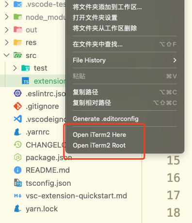

# Open iTerm2 Here or Open Iterm2 WorkBench RootDir For VSCode

1. Open iTerm2 Here: Open iTerm2 with the current file as the directory
2. Open iTerm2 Root: Open iTerm2 with the current workspace as the directory

<small>该插件借鉴于 [Open iTerm2](https://github.com/mushanshitiancai/vscode-open-iterm2.git)</small>